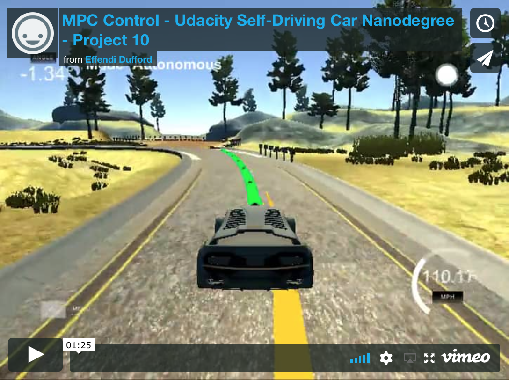

# **MPC Control Project**

**Udacity Self Driving Car Nanodegree - Project #10**

2017/11/16

## Overview

This project implements a **Model Predictive Control (MPC)** algorithm in C++ using **Ipopt** optimizer and **CppAD** automatic differentiation libraries to control steering and throttle while driving a simulated vehicle around a track following reference waypoints.

At each timestep, the **vehicle's state** (global position, heading, speed, steering, and throttle) and the **closest six waypoints** are received by the controller.

Before applying the MPC control, the **vehicle's state is estimated after some expected latency** (processing time and ~100ms actuator delay) using the modeled **motion equations (bicycle model)**.

This estimated state position is then used to **convert the waypoints from global to vehicle coordinate systems**.  The waypoints are then preprocessed with **waypoint interpolation** and **weighting** before applying a **3rd order polyfit** to use as the reference driving path.

The polyfit coefficients and estimated vehicle state after latency are then used by the MPC controller to **optimize a planned driving path over ~1 sec horizon**.  The MPC minimizes a cost function based on a target reference speed, the **cross-track error (CTE)**, the **heading error (EPSI)**, minimal use of actuators and smoothness between actuation steps.  Constraints are applied to the model for it to satisfy the motion equations.

The **steering and throttle actuation from the MPC's first step of the planned driving path** are used to drive the actual car at each timestep including the expected latency delay.  The MPC's planned path coordinates are visualized as a green line with the waypoints shown as a yellow line.

## Project Reflection

For more details about the results of this activity, see the [project reflection document](Reflection.md).

## Key Files

| File              | Description                                                                                                    |
|:-----------------:|:--------------------------------------------------------------------------------------------------------------:|
| /src/main.cpp     | Source code for **main loop** that handles **uWebSockets communication to simulator**                          |
| /src/MPC.cpp, .h  | Source code for **MPC  algorithm** that controls the steering and throttle to follow reference waypoints along the track |
| /build/mpc        | Output **executable program binary**                                                                           |
| [Reflection.md](Reflection.md)     | **Reflection document** describing the MPC tuning activity                                                |
| install-mac.sh    | Script for Mac to install uWebSocketIO required to interface with simulator                                    |
| install-ubuntu.sh | Script for Linux to install uWebSocketIO required to interface with simulator                                  |

The original Udacity project repository is [here](https://github.com/udacity/CarND-MPC-Project).

## How to Build and Run Code

This project involves the Udacity Term 2 Simulator which can be downloaded [here](https://github.com/udacity/self-driving-car-sim/releases)

This repository includes two scripts (**install-mac.sh** and **install-ubuntu.sh**) that can be used to set up and install [uWebSocketIO](https://github.com/uWebSockets/uWebSockets) for either Linux or Mac systems.

Once the install for uWebSocketIO is complete, the main program can be built and run by doing the following from the project top directory.

1. mkdir build
2. cd build
3. cmake ..
4. make
5. ./mpc

If using Xcode to build, run the following commands:

1. mkdir xbuild
2. cd xbuild
3. cmake -G "Xcode" ..
4. Open "MPC.xcodeproj" in Xcode and build
5. cd Debug
6. ./mpc

## Other Important Dependencies

* cmake >= 3.5
  * All OSes: [click here for installation instructions](https://cmake.org/install/)

* make >= 4.1 (Linux, Mac), 3.81 (Windows)
  * Linux: make is installed by default on most Linux distros
  * Mac: [install Xcode command line tools to get make](https://developer.apple.com/xcode/features/)
  * Windows: [Click here for installation instructions](http://gnuwin32.sourceforge.net/packages/make.htm)

* gcc/g++ >= 5.4
  * Linux: gcc / g++ is installed by default on most Linux distros
  * Mac: same deal as make - [install Xcode command line tools](https://developer.apple.com/xcode/features/)
  * Windows: recommend using [MinGW](http://www.mingw.org/)

* uWebSockets (see above)

* **Ipopt and CppAD:** Please refer to [this document](https://github.com/udacity/CarND-MPC-Project/blob/master/install_Ipopt_CppAD.md) for installation instructions.

* [Eigen](http://eigen.tuxfamily.org/index.php?title=Main_Page). This is already part of the repo so you shouldn't have to worry about it.

## Communication protocol between uWebSocketIO and Simulator

**INPUT to main.cpp**: values provided by the simulator to the C++ program

* ["ptsx"] => Closest waypoints global x position (m)
* ["ptsy"] => Closest waypoints global y position (m)
* ["psi"] => Vehicle's global heading (rad)
* ["psi_unity"] => Vehicle's global heading in Unity coordinates (rad), not used
* ["x"] => Vehicle's global x position (m)
* ["y"] => Vehicle's global y position (m)
* ["steering_angle"] => Vehicle's last steering angle (rad)
* ["throttle"] => Vehicle's last throttle (-1 to +1)
* ["speed"] => Vehicle's last speed (mph)

**OUTPUT from main.cpp**: values provided by the C++ program to the simulator

* ["steering_angle"] <= Control value for steering angle (-1 to +1)
* ["throttle"] <= Control value for throttle (-1 to +1)
* ["mpc_x"] <= MPC's planned path x coordinates for visualization (green line)
* ["mpc_y"] <= MPC's planned path y coordinates for visualization (green line)
* ["next_x"] <= Waypoint x coordinates for visualization (yellow line)
* ["next_y"] <= Waypoint y coordinates for visualization (yellow line)
