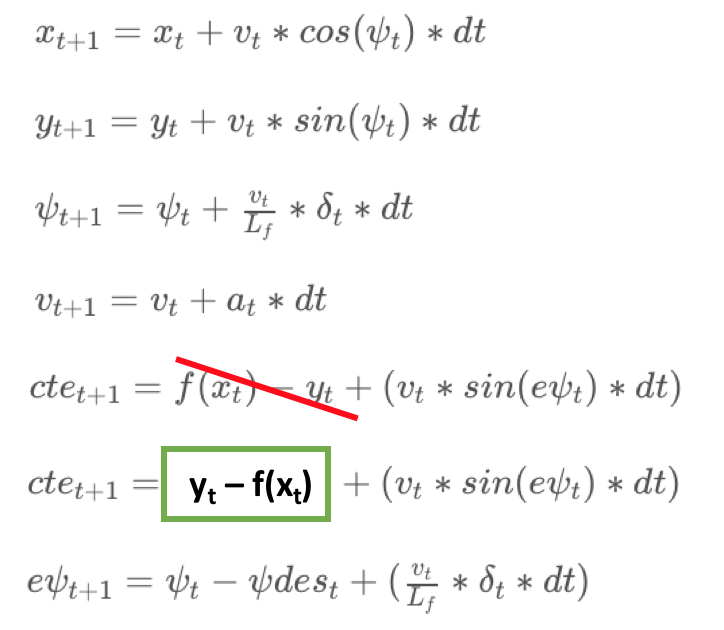
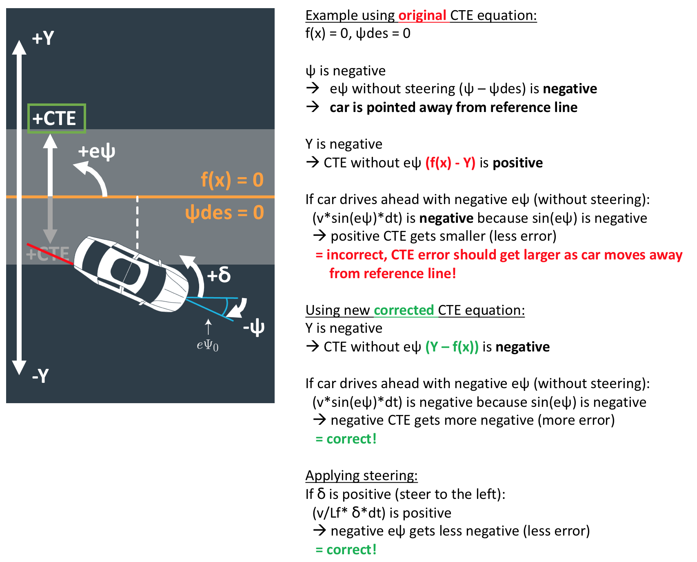
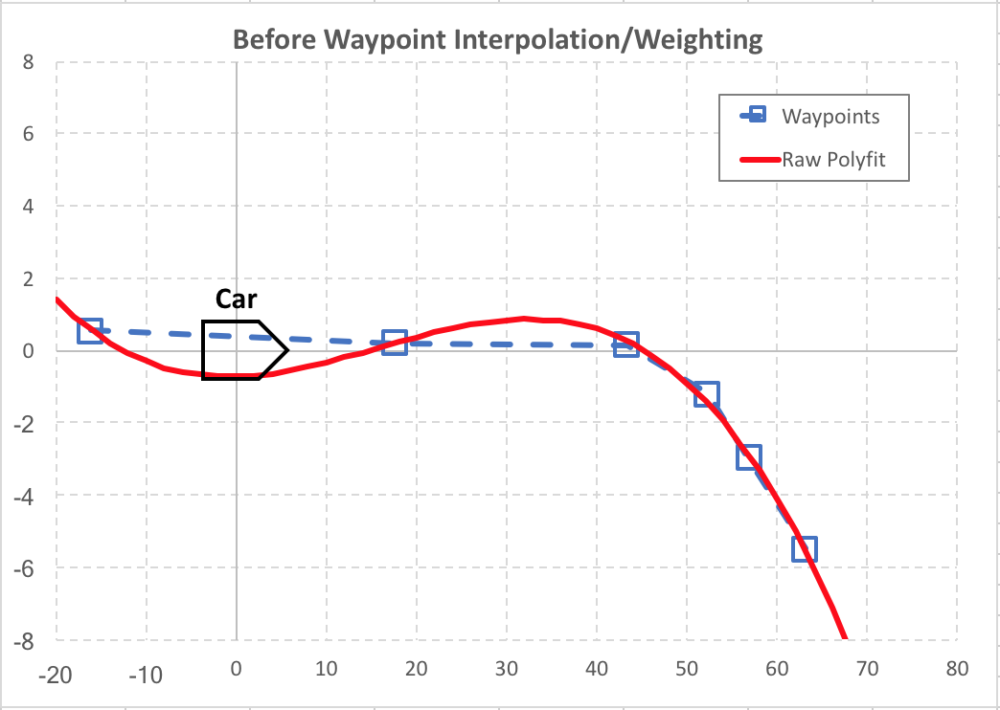
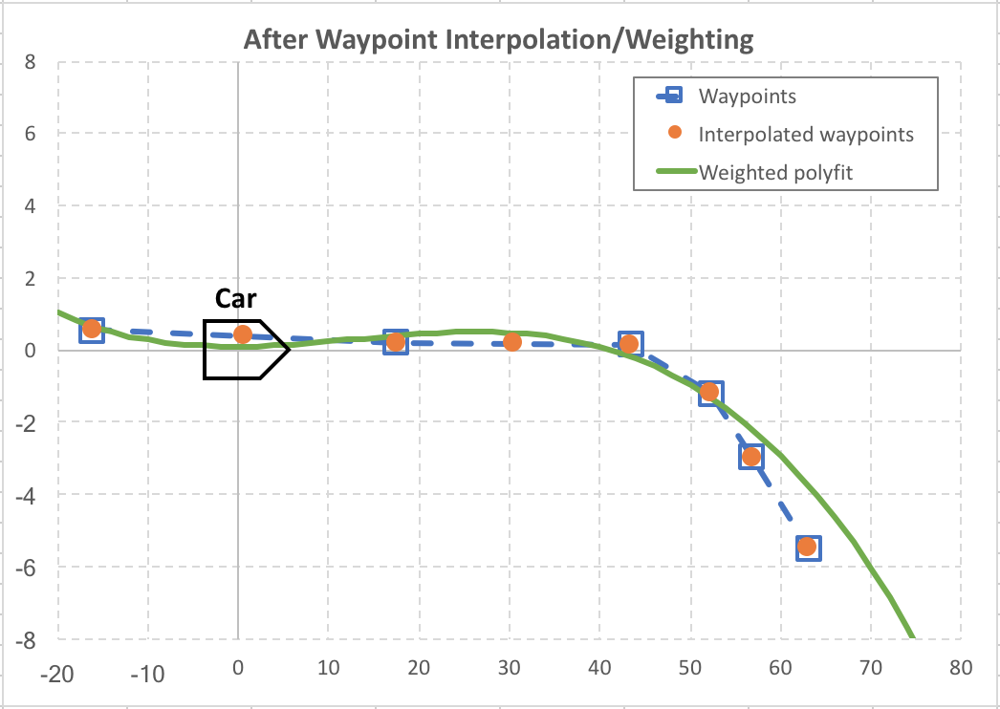
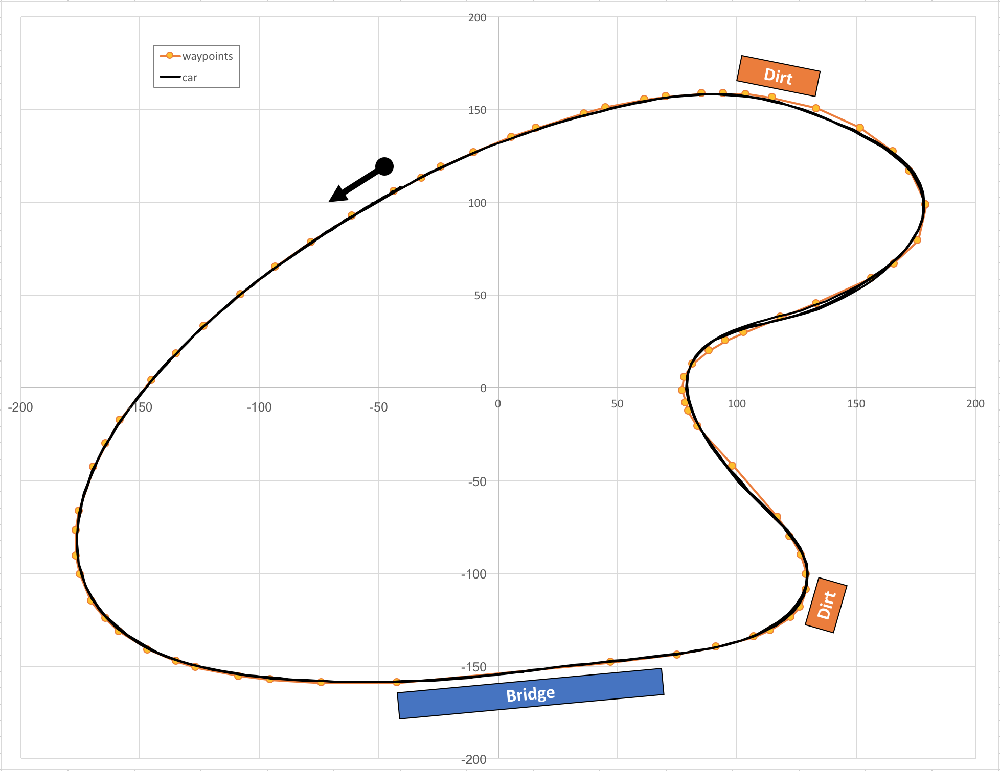
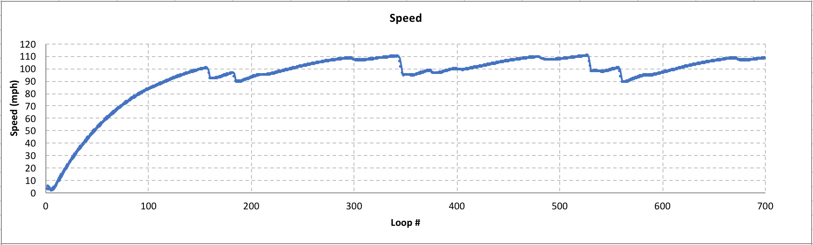
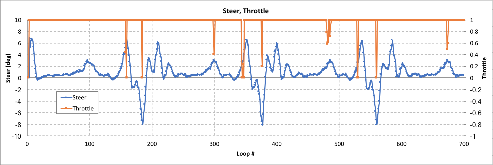
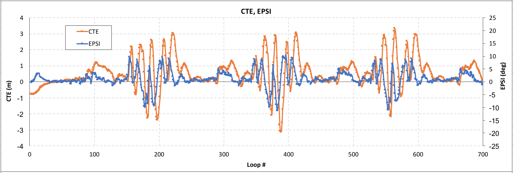

# **MPC Control Project - Reflection**

**Udacity Self Driving Car Nanodegree - Project #10**

2017/11/16

## Implementation

Model Predictive Control (MPC) can achieve **smoother and more realistic driving control than simple PID control** because it uses motion model equations to **plan out a driving path over a finite time horizon** to follow a reference driving line (waypoints), similar to how a real driver would behave by looking down the road ahead.

To do this, the MPC algorithm **optimizes a cost function** to minimize various parameters such as **Cross-Track Error (CTE)** and **heading error (EPSI)** while also balancing the amount of actuator inputs and smooth changes between actuations at each time step.  To tune this controller, the **cost term weights are adjusted** to try to get the optimization to follow the desired priorities.

Tuning an MPC controller's cost function is **more indirect and complicated** than a straightforward PID controller, but the resulting driving behavior is more natural.  The MPC optimization calculation also requires **much more processing time** than PID, but **some latency delay can be compensated for** by using the expected motion model equations.  This also makes MPC **more robust to acuator delays** than PID control.

<iframe allowFullScreen frameborder="0" height="564" mozallowfullscreen src="https://player.vimeo.com/video/243175608" webkitAllowFullScreen width="640"></iframe>

### The Model

The **motion model equations** are from the basic bicycle model as provided by the Udacity lessons, except **the equation for CTE needed a correction**.

See the corrected motion model equations below:

The original CTE equation caused positive CTE in the direction of negative Y values which caused a mismatch where CTE would decrease as car moved away from reference line.  See the example below:

The only vehicle parameter is **Lf** which represents the distance from the car's CG to the steering axle in order to approximate the effective turning radius.  The value for Lf was left equal to 2.67 m as determined experimentally in the simulator by Udacity.

The **state variables** are the car's position (x, y), heading (psi), velocity (v), lateral distance error from the reference line (CTE), and heading error from the reference line (EPSI):

* State variables = (x, y, psi, v, CTE, EPSI)

The **actuators** are steering angle (delta: +1 = 25 deg to left, -1 = 25 deg to right) and throttle/brake (throttle: +1 = WOT, -1 = full brake).

* Actuators = (delta, throttle)

*Note: The simulator's steering control has the opposite direction (+1 = right, -1 = left), so the controller switches the sign of the steering values when sent/received from simulator*

This model covers the basic kinematics of the car movement, but it **does not contain dynamics such as a tire slip model**.  This means that the predicted movement is only accurate for relatively small steering angles and stable conditions where there is no significant tire slip and the vehicle follows the steered path.  This will become important later when attempting to compensate for latency.

### Timestep Length and Elapsed Duration (N & dt)

Using the motion model equations described above, the MPC controller plans a driving path over a fixed time horizon.  This time horizon is determined by setting the MPC's timestep length (number of timesteps N) and duration (delta time dt).

To **tune the values of N & dt**, the following method was used:

1. Set the **dt** value to be **larger than the expected control latency** (so the model doesn't try to plan actuation faster than the car can actually deliver) but **small enough to keep a good precision** for the planned path, ~0.1 or 0.2 sec.

2. Choose an **overall time horizon** that's a reasonable look-ahead time similar to a real driver, and that plans the path far enough down the road to go through the track's sharp turns well, ~1 or 2 sec.

3. Set the number of timesteps **N** to get the desired overall time horizon and dt, considering that as more timesteps are used, the latency delay from longer processing time will become worse.

Initially, since the expected actuation latency was 100ms, I started with N = 10 and dt = 0.1 sec for a 1 sec overall time horizon, but this did not account for additional latency from the controller's processing time.  After using timestamps to measure the actual total latency of each control step, the total latency was closer to ~130ms so I added some margin by increasing dt and then could reduce N to keep a similar overall time horizon.

After tuning, the **final values** chosen are:

* N = 8
* dt = 0.15 sec

This results in an overall time horizon of 8 * 0.15 = 1.2 sec.

### Polynomial Fitting and MPC Preprocessing

At each control loop, the controller receives a set of the car's nearest 6 waypoint global coordinates from the simulator.  These waypoints need to be fitted with a polynomial to interpolate a line connecting them to use as the MPC's reference line.

However, because of the expected latency, the car will have continued to move for ~130ms from the time the waypoints were received before the control can be actuated, so some compensation is needed to keep stable control.

To **compensate for this latency and preprocess the waypoints** to polyfit the reference line, the following method was used:

1. **Estimate the car's state after the expected latency** by using the motion model equations described in the previous Model section above.  The latency amount is determined as a **moving average of the controller's measured total latency** calculated by timestamps.  Since the car's velocity and heading are not constant during this latency time, use the predicted **average velocity and heading over the latency time period to estimate the new x, y position**.

2. **Convert the waypoints from global to vehicle coordinates** at the vehicle's estimated position from step 1.

3. Add **interpolated points** and **weighting** to the first two sections of waypoints before the polyfit to prevent the reference line from curving away from the car's current position.  Waypoints closer to the car should be followed closer than the waypoints that are far away.

4. Do a **weighted polyfit** to get 3rd order polynomial coefficients as the reference line to have enough curvature to handle the road's turns.

The reason for the step #3 waypoint interpolation and polyfit weighting is shown in the figures below:

*Figure 1 - Example polyfit BEFORE waypoint interpolation/weighting where reference line curves away from car to follow the curvature farther down the road*

*Figure 2 - Example polyfit AFTER waypoint interpolation/weighting where reference line stays closer to the car for improved control accuracy and stability*

After setting the reference line, the MPC controller is passed the car's state (estimated after the latency) and the reference line polynomial coefficients to plan the driving path.

### Model Predictive Control with Latency

The MPC algorithm is implemented using the Ipopt and CppAD C++ libraries.  A cost function is defined and tuned to get the desired driving behavior from the controller's optimization.  Constraints are applied for the controller to follow the motion model equations described above and also the actuator limits.

Once the solver plans the driving path, only the first step actuations are actually sent back to the simulator to drive the car at each loop.  However, the optimization should result in a similar optimized driving path at each step so it can maintain smooth driving control overall.

The key to the MPC's performance is the cost function which includes the following cost terms to be minimized:

1. **Basic CTE** - to get car to follow the line

2. **Basic EPSI** (progressive cost increases linearly by timestep) - to keep car heading in the right direction but with heavier weighting looking farther down the road

3. **Difference from target reference velocity** - to keep the car accelerating to the target speed

4. **Difference from angle to end point of horizon** (progressive cost increases linearly by timestep) - to allow the car to cut the corners of the sharp turns a bit to improve the driving line and achieve higher speed

5. **Absolute steering angle** - to encourage driving as straight as possible to achieve higher speed and stay within stable tire dynamics to keep accuracy of latency estimation

6. **Change in sequential steering actuations** - to smooth out changes in steering

7. **Change in sequential throttle (acceleration) actuations** - to smooth out changes in acceleration/braking

The model can compensate well for the expected 100 ms actuator latency using the state estimation method described in the previous MPC preprocessing section above, but in order for the motion model equations to be accurate, the steering needs to stay within the region of stable tire dynamics that are not included in the equations.  Because of this, the cost term #5 for absolute steering angle is heavily weighted to keep steering angles as small as possible.

## Simulation Result

Data from the simulation result of the MPC controller is shown below:

The MPC controller is able to keep a **good driving line** with **smooth steering** and achieves a **peak speed of 110 mph**!  It is also able to stay between 90-110 mph for each lap.

Of course, this implementation was tuned for max speed on the simulator's race track so **normal driving on city streets would need different cost function tuning**, but using MPC control should be able to achieve good results with driving behavior that is more natural than a simple PID controller.